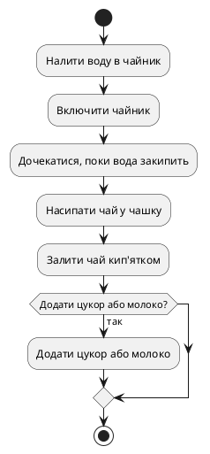
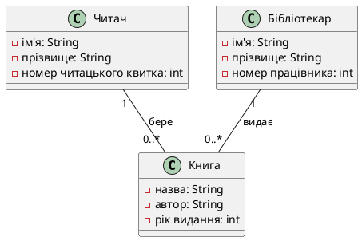

# Лекція 5: Основи UML для учнів 8 класу

## Вступ

Ласкаво просимо на лекцію про основи UML! UML (Unified Modeling Language) - це мова моделювання, яка використовується для візуалізації, проектування та документування програмних систем. У цій лекції ми розглянемо два основних типи діаграм UML: діаграми активності та діаграми класів.

## Діаграма активності

Діаграма активності показує послідовність дій або кроків у процесі. Вона допомагає зрозуміти, як виконується процес від початку до кінця. Давайте розглянемо простий приклад діаграми активності для процесу приготування чаю.

### Приклад діаграми активності

1. Початок процесу
2. Налити воду в чайник
3. Включити чайник
4. Дочекатися, поки вода закипить
5. Насипати чай у чашку
6. Залити чай кип'ятком
7. Додати цукор або молоко (за бажанням)
8. Кінець процесу

## Діаграма класів

Діаграма класів показує структуру системи, включаючи класи, їх властивості, методи та зв'язки між ними. Вона допомагає зрозуміти, як різні частини системи взаємодіють одна з одною. Давайте розглянемо простий приклад діаграми класів для системи управління бібліотекою.

### Приклад діаграми класів

1. Клас "Книга" з властивостями "назва", "автор" та "рік видання"
2. Клас "Читач" з властивостями "ім'я", "прізвище" та "номер читацького квитка"
3. Клас "Бібліотекар" з властивостями "ім'я", "прізвище" та "номер працівника"
4. Зв'язок між класами "Читач" та "Книга" (читач може брати книги)
5. Зв'язок між класами "Бібліотекар" та "Книга" (бібліотекар може видавати книги)

## Висновок

У цій лекції ми розглянули основи UML, включаючи діаграми активності та діаграми класів. Ці діаграми допомагають візуалізувати процеси та структуру системи, що робить їх корисними інструментами для проектування та документування програмних систем. Сподіваємося, що ця лекція допомогла вам зрозуміти основи UML та їх застосування.
